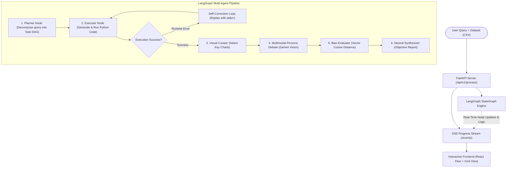

# report-assist


**report-assist** is an autonomous multi-agent data analysis and reporting platform. It takes raw tabular datasets (CSV/Excel) and natural language queries, orchestrates an end-to-end **LangGraph StateGraph** to write and self-correct executable Python code, generates visualizations, and applies a **Bias-Contrastive Multi-Agent Debate** using **Google Gemini** to prevent cognitive and confirmation bias in executive reporting.

---

## 🌟 Why report-assist?

When humans or single-prompt LLMs analyze data, they naturally suffer from **confirmation bias**—fixating on data points that confirm their initial thesis while ignoring counter-indicators.

`report-assist` counters this by **deliberately simulating divergent cognitive biases**:
1. It decomposes user queries into a Directed Acyclic Graph (DAG) of data science tasks.
2. It executes Python code in a self-healing loop (catching syntax or runtime errors and automatically repairing them).
3. It hands off generated charts to contrasting persona agents:
   - **The Optimistic 📈**: Focuses strictly on upside potential, top-line growth, and favorable momentum.
   - **The Pessimistic 📉**: Focuses strictly on downside risks, cost pressures, liabilities, and volatility.
   - **The Skeptic 🕵️**: Challenges data integrity, sample size limitations, and confounding variables.
4. It mathematically quantifies each persona's semantic bias using sentence embeddings to compute a **Neutrality Index**.
5. A **Neutral Arbitrator** synthesizes the conflicting viewpoints, strips away emotional rhetoric, highlights genuine disagreements, and produces an objective executive report.

---

## 🏗️ Architecture



---

## 🚀 Key Engineering Highlights

- **LangGraph StateGraph Workflow**: Built on an idiomatic LangGraph `StateGraph` with explicit state schemas, typed transitions, and clean separation between planning, execution, and analytical reflection.
- **Self-Healing Code Execution Loop**: Sandboxed code execution dynamically captures `stdout` and `stderr`. If a script fails, the agent introspects the error trace and iteratively refines the code.
- **Multimodal Vision (Google Gemini)**: Directly passes rendered Matplotlib and Seaborn plots into Gemini's multimodal vision model, allowing agents to "read" charts, anomalies, and distributions visually.
- **Semantic Vector Bias Quantification**: Employs `SentenceTransformer` (`all-MiniLM-L6-v2`) embeddings to calculate cosine similarity against canonical anchor vectors, producing an empirical `bias_score` ($-1.0$ to $+1.0$) and a `neutrality_index` ($0.0$ to $1.0$).
- **Reactive UI with React Flow**: A Next.js 16 + React 19 interface visualizing the live TaskGraph DAG using `@xyflow/react` and `dagre`, with real-time SSE streaming, interactive persona cards, and a zoomable artifact viewer.

---

## 🛠️ Tech Stack

| Domain | Technologies |
| :--- | :--- |
| **Agentic AI & LLMs** | LangChain, LangGraph, Google Gemini (`gemini-2.5-flash`), `langchain-google-genai` |
| **Data & Math** | Pandas, NumPy, Scipy, Scikit-Learn, Matplotlib, Seaborn, SentenceTransformers, TextBlob |
| **Backend API** | Python 3.11, FastAPI, Uvicorn, Pydantic v2, Python-JSON-Logger |
| **Frontend UI** | Next.js 16 (App Router), React 19, TypeScript, React Flow (`@xyflow/react`), Dagre, Tailwind CSS, Radix UI, Lucide Icons |

---

## ⚡ Quickstart Guide

### 1. Backend Setup

```bash
cd backend

# 1. Create and activate a virtual environment
python3.11 -m venv .venv
source .venv/bin/activate

# 2. Install dependencies
pip install -r requirements.txt

# 3. Configure environment variables
cp .env.example .env
# Edit .env and set your GEMINI_API_KEY (from https://aistudio.google.com/)

# 4. Start the backend server
python3 main.py --env local --debug
```
The FastAPI server will start at `http://0.0.0.0:8000`. Swagger documentation is available at `http://localhost:8000/docs`.

### 2. Frontend Setup

```bash
cd frontend

# 1. Install dependencies
npm install

# 2. Configure environment variables
cp .env.example .env.local

# 3. Start development server
npm run dev
```
Open [http://localhost:3000](http://localhost:3000) in your browser.

---

## 📖 How to Use

1. **Upload Dataset**: Navigate to [http://localhost:3000](http://localhost:3000) and upload any CSV dataset (sample datasets are available in [`dev/cleaned.csv`](dev/cleaned.csv)).
2. **Submit Analytical Prompt**: Enter a query such as:
   > *"Analyze the relationship between Gold Price and Volume. Clean the dataset, fit a regression model, and plot the price distributions."*
3. **Observe Real-Time Execution**: Watch the live **TaskGraph** DAG animate in real-time as tasks transition from `pending` to `running` to `success`.
4. **Compare Persona Perspectives**: Expand the **Agent Perspectives** card grid to see how **The Optimistic**, **The Pessimistic**, and **The Skeptic** interpret the generated charts.
5. **Inspect the Neutral Report**: Read the balanced, synthesized executive summary produced by the Neutral Arbitrator with embedded chart callouts.
6. **Tune Agent Hyperparameters**: Click the Settings gear in the top right to adjust prompt instructions, toggle temperature, or switch Gemini model variants on the fly.

---

## 📂 Project Structure

```
report-assist/
├── README.md                      # Project documentation and architecture guide
├── backend/                       # FastAPI & LangGraph backend
│   ├── main.py                    # Server startup script
│   ├── requirements.txt           # Python dependencies
│   ├── pyproject.toml             # Poetry configuration
│   ├── settings.json              # Active LLM configs, prompts, and personas
│   ├── core/                      # Configuration, settings, and base exceptions
│   │   └── config.py              # Pydantic BaseSettings management
│   └── app/
│       ├── server.py              # FastAPI app factory
│       ├── api/v1/process.py      # REST & SSE streaming endpoints
│       └── services/agent/        # Core agent framework
│           ├── workflow.py        # LangGraph StateGraph pipeline
│           ├── llm_factory.py     # Unified Google Gemini & LangChain client factory
│           ├── master.py          # Master agent coordinator
│           ├── graph.py           # TaskGraph data structure & Topological Sorter
│           ├── action_graph.py    # Python code action sequencer
│           ├── sub_agents.py      # Multimodal Gemini vision & persona sub-agents
│           ├── bias_evaluator.py  # SentenceTransformer semantic bias quantification
│           ├── schemas.py         # Pydantic schemas & TypedDict state definitions
│           └── utils.py           # CodeExecutor namespace & SessionWorkspace
├── frontend/                      # Next.js 16 interactive UI
│   ├── package.json               # Frontend dependencies
│   ├── app/                       # Next.js App Router pages & API proxies
│   ├── components/
│   │   ├── chat/                  # Chat panel, persona grid, bias spectrum, artifact viewer
│   │   └── graph/                 # React Flow interactive DAG visualizer
│   ├── hooks/use-chat-stream.ts   # SSE streaming connection hook
│   └── lib/                       # Types and utility helpers
└── dev/                           # Exploratory datasets and prototyping notebooks
    ├── langgraph.ipynb            # Interactive LangGraph prototype notebook
    └── cleaned.csv                # Sample tabular dataset for testing
```

---

## 📄 License

MIT License. Designed and developed as an open-source autonomous agentic reporting platform.
